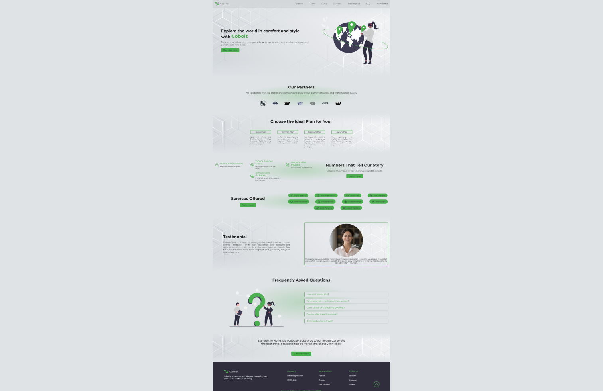

# Cobolto

Our travel landing page is an engaging and intuitive platform that offers users the opportunity to explore amazing destinations with comfort and style. Featuring a variety of personalized packages and exclusive itineraries, the site is designed to turn your vacations into unforgettable experiences. Browse partnerships with renowned brands, discover ideal plans for all types of travelers, and access valuable information through testimonials and FAQs, all in one place to simplify your travel planning.

## Layout preview

## About

Cobolto is a modern web application designed to simplify the planning and exploration of travel. Built with TypeScript and React.js, the project emphasizes type safety and a seamless user experience. Utilizing Vite for fast development and optimized builds, Cobolto ensures high performance and responsiveness.

The application features a clean and modular architecture, adhering to solid development principles, including the implementation of SOLID and BEM Architecture principles. Navigation is efficiently managed with React Router, providing a smooth navigation experience. Styling is handled by Sass, allowing for customizable and maintainable styles.

To ensure code quality, the project incorporates ESLint and Prettier to maintain consistency and best practices. Additionally, Storybook is used to develop and document components in isolation, providing a clear visualization and testing of interface elements before final integration.

## Technologies

-   TypeScript
-   React.js
-   Sass
-   StoryBook

## User features

-   **Responsiveness**: interface adjusts to different screen sizes, ensuring a good experience on both mobile devices and desktops.
-   **Page Structure**: easy navigation between sections, with support for scroll-to-top functionality.
-   **Partner Information**: view the partners and brands we collaborate with to ensure quality in your travels.
-   **Travel Plans**: choose from different available packages and plans.
-   **Testimonials**: read experiences from clients who traveled with Cobolto, highlighting the quality and satisfaction of the services offered.

## Deploy

Access the [Live Demo](https://igorchaves-cobolto.vercel.app/) or copy the URL directly: `https://igorchaves-cobolto.vercel.app/`

## How to Use

**Running app:**

-   Clone this repository to your computer
-   Install dependencies using the command: `pnpm i`
-   Start the development server with: `pnpm dev`
-   Open your browser and navigate to: `http://localhost:3000`

**Running StoryBook:**

-   To view the components and their variations, use the command: `pnpm storybook`
